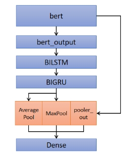

# 1. **任务分析**

## 1.1问题背景

随着健康医疗信息化的发展以及云计算、物联网、移动智能等技术在健康医疗领域的广泛应用，医疗行业汇聚了大量可以发挥出实际价值的海量的医学数据。这些医学数据是医疗研究与进步的基石。

## 1.2相关工作

多标签分类，首先是一个文本分类任务，然后是一个多标签的任务。最早期的时候多标签分类任务不考虑各种标签之间的关联关系，如二元关联法，到将标签之间的关系考虑进去，如分类器链与标签集合法。二元关联法实质上是将每个标签独立分离开来看待，将一个多分类问题转化为多个二分类问题。分类器链法是通过每次预测一个标签后，将此标签纳入特征范围内，作为新的标签参与预测。标签集合法是将训练集中出现过的所有标签作为一个集合整体，通过对这种集和整体的多分类预测来解决多标签分类问题。但是这些基于深度学习的方法由于在性能上面仍有欠缺，所以逐渐被深度学习方法代替。

之后，深度学习方法逐渐发展起来。大规模的预训练语言模型开始出现在公众的视线之中，这些预训练模型可以缩短人们花费在特征提取工作上的时间，使得自然语言处理走向另一个阶段。Bert, roberta, ernie等就是这类基于预训练任务的自然语言处理模型。这些预训练任务往往是基于大量的语料。在有足够的算力情况下，通过对下游任务的微调工作，模型能够发挥出优越的表现。通过对具体问题具体语料下的分析和模型结构的调整，预训练模型结构可以发挥出更加优异的效果。

## 1.3赛题描述

基于给出的与健康有关的中文问句，对问句的主题进行分类（共包含 6 个大类：A 诊断、B 治疗、C 解剖学/生理学、D 流行病学、E 健康生活方式、F 择医）。由于一个中文健康问句往往归属于多个主题类别，在测试集上的 F1-score 来衡量团队的表现。

训练集和测试集的文本长度分布比较一致，从中我们也可以看出文本长度大部分小于512，且集中分布在150左右，在后续调参中需要考虑到这些因素。

# 2. **实验**

## 2.1数据处理

### 2.1.1数据清洗

表2-1 部分数据集示例

| QCT1000000618 | 背上双胛长了"黑毛刺"健康咨询描述：宝宝7、8天的时候，背上双胛长了两片不小的“黑毛刺”，有人说是“黑毛疹”，见附图。不知道有没有科学的说法，反正现在洗澡每次擦鸡蛋清少许并揉搓一阵子，不知道这样有用吗？还希望专家从科学的角度解释一下。 <IMGsrc="http://www.120ask.com/UploadFiles/2006125101813313.jpg"onload="javascript:if(this.width500)this.style.width=500;"border=0>  |
| ------------- | ------------------------------------------------------------ |
|               |                                                              |

在训练集和测试集中文本中有一些含有html5标记语言和 标签，在这里我们采用正则表达式的方法进行清洗。但用清洗后的数据跑实验，发现效果反而下降了。我们推测这些“脏数据”可能也包含了类别信息，故模型所用数据还是采用原始数据。

### 2.1.2中英回翻

为了增强模型的泛化性能，我们将文本数据先反应成英文，再回译成中文。虽然回译后的文本在测试集上的性能下降了，但可以将得出的结果参与到最终的模型融合中。

### 2.1.3 EDA

由于时间的关系，我们这次并没有采用EDA数据增强的方式，不过听群里其他小伙伴说，改方法可以提高一些成绩。

# **3.模型尝试**

本次比赛我们使用了bert、roberta、erine等多种模型，并尝试进行改进，通过不同的模型测试在测试集上的效果。改进方法参考自知乎等平台的方案分享。

## 3.1 bert-www和roberta-large

首先我们尝试了以上两种base模型，将bert输出的sequence_out取平均并于pooler_out拼接，作为6分类器的输入，输入则是采用sigmod函数进行多标签分类。在未调参的情况下两种模型在测试集上的得分分别为0.63+和0.65+。故以下对模型进行改进时均以roberta-large模型作为base模型。才外我们还尝试了医疗领域的mc-bert和mt-bert，效果好于bert-wwm，但差于roberta-large，故没有后续使用。

## 3.2 BERT-BiGRU与BERT-BiLSTM

BERT预训练模型学习到的token向量输入这两种模型结构进行进一步学习，让模型更好的理解文本的上下关系，最终通过average pooling层并softmax输出分类结构。我们基于此，采取了多种bert输出加RNN组合的方式。

模型结构如图3-1所示。

​                                                                                                             图3-1 BERT-BiGRU/BiLSTM-平均池

(1)将BERT类模型的sequence_out接入双向GRU或

双向LSTM后再分类，如图3-2。

(2)将BERT类模型的输出接入双向LSTM后再接入双向GRU，对输出结果进行平均池化和最大池化再与BERT类模型的pooler_out进行拼接后再分类,如图3-3。

​																													图3-2 模型结构改造图a

​																											 

​																														图3-3 模型结构改造图b

（3）取BERT类模型的最后两层的第—状态位和pooler_out进行拼接以获取更多的句意信息，如图3-4。

​																											 

​																															图3-4 模型结构改造图c

（4）将BERT类模型的输出字向量与词向量拼接后接入卷积层，再进行最大池化和平均池化，如图3-5，通过把词向量和字向量拼接的方式能够学习到新热点事件中出现的一些新词汇所包含的信息，同时向量信息也更加丰富。

​																														 

​																																图3-5 模型结构改造图d

（5）将BERT类模型的输出字向量与词向量拼接双向LSTM后再接入双向GRU后接入卷积层，再进行最大池化和平均池化，如图3-6。

​																														 

​																																图3-6模型结构改造图e

（6）BERT多层表示的动态权重融合Ganesh Jawahar等人[2]通过实验验证了BERT[3]每一层对文本的理解都有所不同。为此，我们对BERT进行了改写，将BERT的十二层transformer生成的表示赋予一个权重,权重的初始化如公式（1）所示，而后通过训练来确定权重值，并将每一层生成的表示加权平均，再通过一层全连接层降维至512维如公式（2）所示，最后结合之前的Bi-GRU和Bi-LSTM模型来获得多种异构单模。BERT多层表示的动态权重融合结构如图3-7所示。其中represent,为BERT每一层输出的表示，αi为权重BERT每一层表示的权重值。

​																										    (1)

​																									(2)

​																						 

​																							图3-7 BERT多层表示的动态权重融合结构

 比赛后几天发现，文本中问句出现的位置大都集中在首部或尾部，因此我们一方面加大文本长度，一方面采取句首句尾平均的思想采取roberta训练模型。由于时间原因，只采去了torch.cat((seq_avg, pooler_output), dim=1)方式进行训练，结果如表3-2所示。

# **4.后处理**

## 4.1半监督思想

 

# 											 

​																											图4-1 半监督思想模型图

将得出最高结果的测试文件及结果和原始训练集一起送入模型在训练，得到进一步的提高。

## 4.2分类阈值搜索

采用分类阈值搜索来找到最佳阈值，但是此方法结果不问题，考虑到训练集和测试集来源及分布差异较大，故放弃了该方法。

## 4.3模型融合

由于我们最好采取的模型测试集得分有0.66+，而其他模型得分只有0.65+，我们采取了投票法和概率平均法进行融合，效果均有下降，由于时间关系没有继续融合。或者通过比较各个文件的差异度，选择差异性较大的结果进行融合效果更好。

# 5. **总结与展望**

本次比赛由于测试集给的晚且提交次数的限制，能够尝试的方法较少且效果不佳，然后前排大佬的得分依旧很高，令人羡慕和崇拜，考虑到还有几项可优化的点：

（1）数据集不平衡，C类在训练集中有1个，和测试集中有16个（群里小伙伴计算得出）。通过增加训练集中C类的样本数或许能够进一步提高成绩。

（2）细致调参，不过此种方法耗时且提升效果不明显。

（3）外部数据，此类方法可以增强模型的泛化能力，但耗时耗力。

# 6. **参考文献**

[1] https://discussion.datafountain.cn/questions/2628

[2] https://discussion.datafountain.cn/questions/2630

[3] https://tianchi.aliyun.com/mas-notebook/preview/88952/cd6347a0-78b9-11ea-9dd8-017940852515.ipynb/-1?lang=

# 7.部分训练结果

| model         | epoch | maxlen  | batch-size | bert连接分类器方式                                        | kfold | f1-score     |
| ------------- | ----- | ------- | ---------- | --------------------------------------------------------- | ----- | ------------ |
| roberta-large | 5     | 256     | 4          | torch.cat((seq_avg, pooler_output), dim=1)                | 5     | 0.65745647   |
| roberta-large | 5     | 256     | 4          | bert+BiGRU                                                | 5     | 0.653753068  |
| roberta-large | 5     | 256     | 4          | bert+TXwordvec+torch.cat((seq_avg, pooler_output), dim=1) | 5     | 0.65735884   |
| roberta-large | 5     | 256     | 4          | BertDyn_lastfour                                          | 5     | 0.650075584  |
| roberta-large | 5     | 155+155 | 4          | torch.cat((seq_avg, pooler_output), dim=1)                | 5     | 0.664119802  |
| roberta-large | 5     | 255+255 | 4          | torch.cat((seq_avg, pooler_output), dim=1) 半监督         | 5     | 0.6642300030 |

